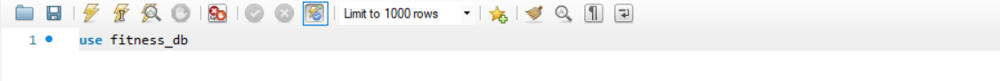
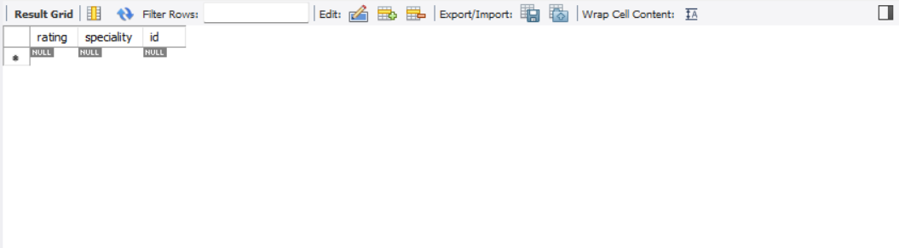
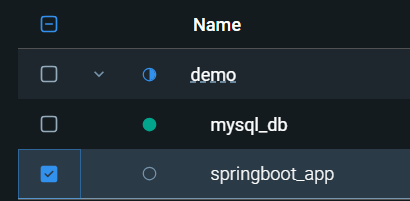
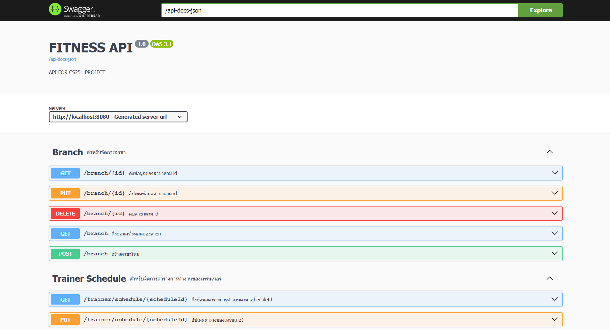

# Fitness API

## How to install
### สิ่งที่ต้องมี
- DBMs Tool ตัวไหนก็ได้ (แต่ในตัวอย่างนี้จะสอนแค่ MySQL Workbench)
- MySQL Server (ตอนที่ Download ครั้งแรกจะถูกถามให้ตั้ง username กับ password ต้องตั้งตามนี้)
``username`` เป็น ``root``และ``password`` เป็น ``root``

### Build project
1. เปิด docker desktop ไว้
2. รัน ``git clone https://github.com/Nattasak-Chonmanat/fitness_backend_cs251.git`` ใน terminal
3. เข้าไปยัง folder ที่ clone มา ``cd path/to/your/project``
4. Make sure ว่าอยู่ระดับเดียวดับไฟล์ ``docker-compose.yaml``
5. รัน ``docker-composer up --build`` ใน terminal
```bash
git clone https://github.com/Nattasak-Chonmanat/fitness_backend_cs251.git
cd path/to/your/project
docker-compose up --build
```


## How to access database
ดาวโหลด MySQL workbench และ MySQL Server(หรือ DBMs ตัวไหนก็ได้แต่อันนี้จะสอนแค่ mysql workbench นะ) 

- คลิกเครื่องหมาย "+" ข้างMysql Connections แล้ว set ตามนี้
- Connection Name : Docker_Database
- HostName : 127.0.0.1 หรือ localhost
- Username : root
- password : คลิก Store in Vault พิมพ์ root คลิก ok
- คลิก Test connection
- ถ้าทุกอย่างถูกต้องจะขึ้น successfully made the connect
- กด ok
- กด ok
- คลิกเข้าไปที่ Docker_Database
- เขียน query ตามนี้ ```use fitness_db;```
- 
- กด Icon 

- ลองพิมพ์ query ```select * from trainer;```
- ถ้าได้ตารางเปล่าตามนีถือว่าทุกอย่างถูกต้องแล้ว



## Document

1. เปิด Docker Desktop ขึ้นมา
2. รัน springboot container ขึ้นมา

3. Copy path url นี้ไปใส่ใน browser ``http://localhost:8080/api-docs-ui``
4. ถ้าทุกอย่างถูกต้องจะต้องได้เว็บหน้าตาแบบนี้
